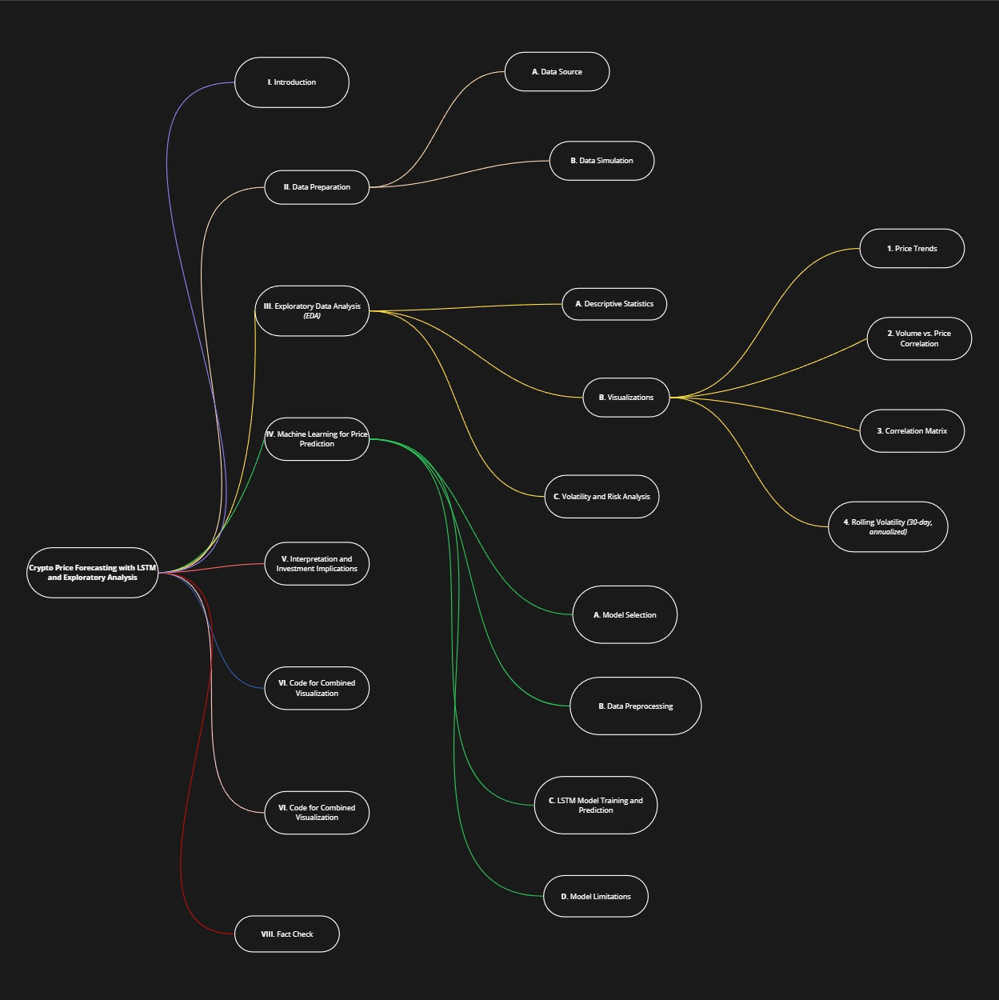

# **Crypto Price Forecasting with LSTM and Exploratory Analysis**

Simulates historical price data for `ADA`, `AVAX`, and `LINK`; performs exploratory data analysis with visualizations and statistics; and trains an *LSTM model* to forecast prices based on time-series features. This reinforces skills in data simulation, EDA, time-series modeling, and deep learning using `TensorFlow`.

***:)***

