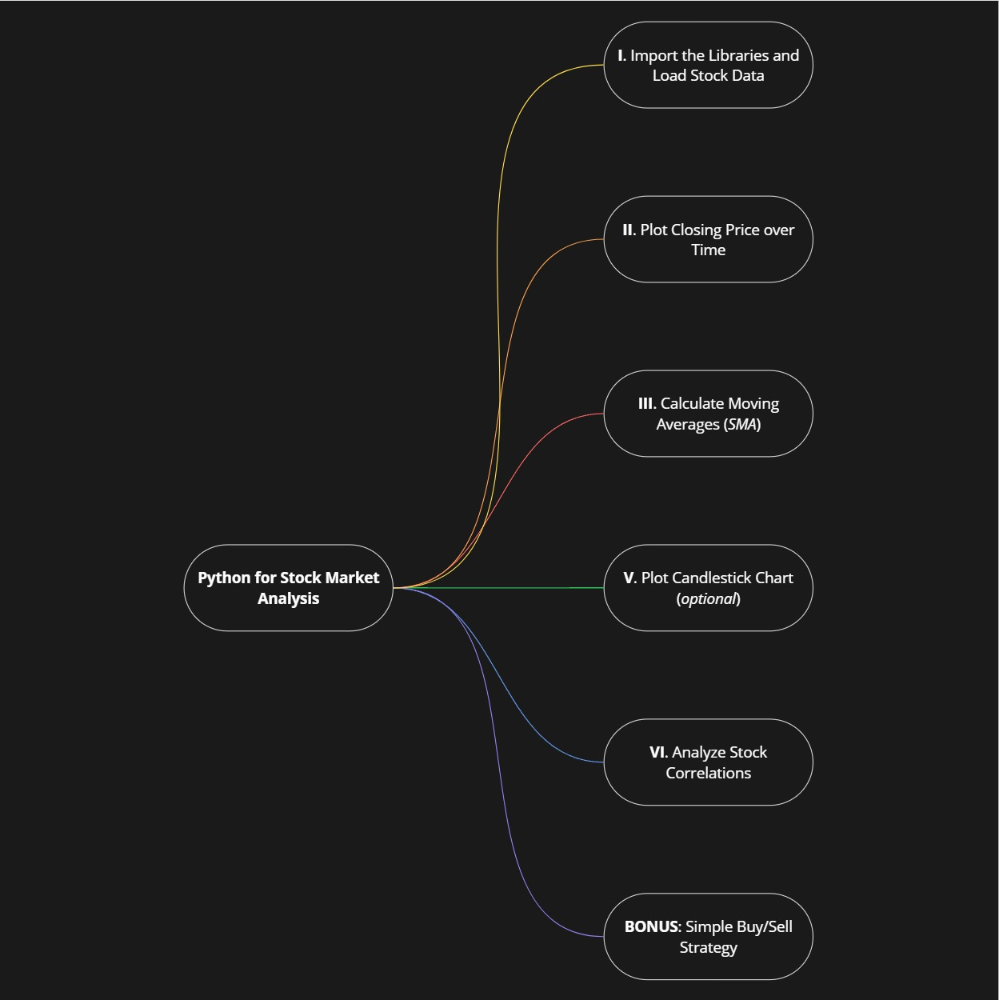

# Python for Stock Market Analysis

This practical Python script uses `yfinance`, `pandas`, and `matplotlib` to fetch real stock data, compute `20-day` and `50-day` simple moving averages (SMAs), and generate basic trading signals. It helps beginners learn financial data analysis and visual signal detection using real-world stock trends.

***:)***

## Credits
📚 **Tutorial Followed:** Python Coding ([@clcoding](https://x.com/clcoding) on Twitter)

🔗 **Original Link:** [https://x.com/clcoding/status/1944251733292585223](https://x.com/clcoding/status/1944251733292585223)